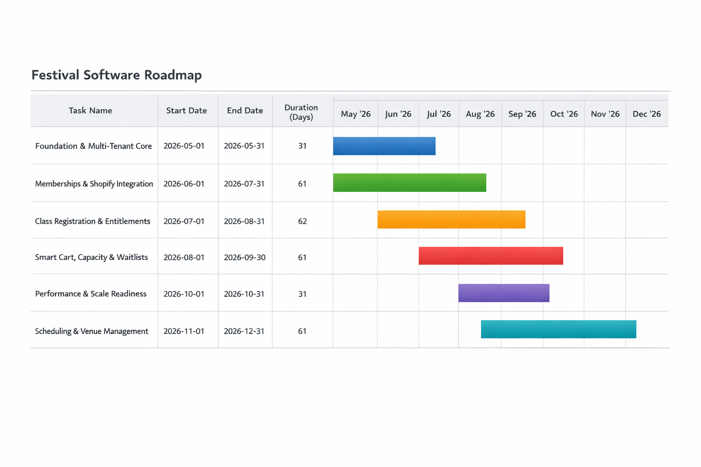

# Festival Software

Festival Software is a purpose-built platform designed to support the full lifecycle of a performing arts festival—from registration and payments to scheduling and event execution.

The system is engineered to replace legacy tools that fail under load, lack flexibility, and create operational friction during peak registration periods.

See [SECURITY.md](./SECURITY.md) for the enforced trust boundaries and operator guidance, plus [Detailed Roadmap](./specs/ROADMAP-2026.md) and [Sidequests](./specs/SIDEQUESTS-2026.md) for more detailed work breakdown.

## Core Approach

This platform is built around a **clear separation of responsibilities**:

* **Shopify** handles payments, checkout, and customer identity for families
* **Local Application** manages festival-specific logic, including registrations, metadata, scheduling, and capacity
* **Firebase** supports internal authentication for administrators and staff

This architecture ensures reliability, scalability, and flexibility while leveraging proven external systems where appropriate.

## Key Capabilities

* **Multi-Tenant Organization Management**
  Support for multiple festivals or organizations with strict data isolation and role-based access control
* **Memberships & Payments (Shopify Integration)**
  Memberships and class registrations are purchased through Shopify, ensuring a stable and familiar checkout experience
* **Class Registration & Entitlements**
  Registrations are modeled as entitlements, with rich metadata captured locally (performer details, repertoire, age group)
* **Capacity Management & Waitlists**
  The system enforces class limits, manages waitlists, and ensures fairness during high-demand registration periods
* **High-Performance Registration**
  Designed to handle peak load scenarios (target: 500+ requests/second) without degradation
* **Scheduling & Venue Management**
  Tools to assign performers to rooms and time slots, supporting real-world festival logistics

## Design Principles

* **Own the Critical Logic**
  Inventory, scheduling, and fairness are controlled locally—not delegated to third-party systems
* **Asynchronous by Default**
  Shopify webhooks drive state changes; all integrations are idempotent and replayable
* **Separation of Identity Domains**
  Families authenticate via Shopify; administrators via Firebase
* **Operational Resilience**
  The system is designed to tolerate inconsistencies and includes reconciliation paths between systems


## Roadmap Overview



* **Foundation & Multi-Tenant Core** — Establish authentication, organizations, and data model
* **Memberships & Shopify Integration** — Enable payments and external identity
* **Class Registration & Entitlements** — Capture structured registration data
* **Smart Cart, Capacity & Waitlists** — Enforce limits and fairness
* **Performance & Scale Readiness** — Validate system under load
* **Scheduling & Venue Management** — Support event execution


## Workspaces
- `packages/common`: shared organization, membership, invite, and auth contracts.
- `packages/backend`: Hono API server and PostgreSQL/Firebase-backed organization services.
- `packages/frontend`: SolidJS browser app for sign-in, org creation, invite acceptance, and org landing.

## Requirements
- [Bun](https://bun.sh/docs/installation) 1.2.x or newer.
- A Firebase project with a web app plus Firebase Authentication enabled for Google sign-in and email-link sign-in.
- A local PostgreSQL server plus the `psql` CLI.
- A repo-root `.env` file aligned with the checked-in `develop.env` reference.
- `nginx` on `PATH` if you plan to run `bun run prod`.

## Setup

Follow [SETUP.md](SETUP.md) for the full step-by-step setup, including:
- Firebase project and service-account setup.
- PostgreSQL role, database, and schema bootstrap.
- Required env-file values and how they map to the app.
- Local development and production commands.

### Shopify Membership Product Setup

Organization Admins configure Shopify from `/org/:slug/admin/integrations`.
Membership product creation requires a verified organization-scoped Shopify
integration with:

- `store_domain`: a `*.myshopify.com` store domain.
- `client_id`: the app client ID used for Shopify Admin API access.
- `client_secret`: stored encrypted server-side using the tenant-bound Shopify
  keyring configured by `FESTIVAL_SECRET_KEYS_JSON` and
  `FESTIVAL_ACTIVE_SECRET_KEY_ID`.
- `verification_status = ok`: confirms the canonical shop identity. The admin
  membership form can create products only when the independently reported
  `read_products` and `write_products` capabilities are both granted.

The browser calls only Festival backend APIs. Shopify Admin API credentials,
tokens, and raw Admin responses must remain server-side. The backend uses the
saved organization integration and Shopify Admin GraphQL `2026-07`. Access
tokens are held only in an early-expiry, process-local cache keyed by the full
tenant integration identity and are invalidated when credentials are saved or
rotated.

Every attempted Shopify product mutation writes one minimal audit record to
`/var/log/festival/shopify-admin-audit.ndjson`. Deployment operations must
provision that path and own log rotation and retention; Festival does not store
these records in PostgreSQL or rotate the file itself.

Manual release validation for a development store should create one membership
from `/org/:slug/admin/memberships`, confirm the Shopify product has a single
`Plan = Standard` variant, and confirm `/org/:slug/membership` renders current
Shopify-backed name, description, and price. Do not commit development-store
credentials or tokens.

### Shopify Customer Account BFF

Public customers use Shopify's new Customer Accounts through Festival's Hono
backend-for-frontend. This identity is separate from Firebase Admin identity.
Organization Admins configure it in the distinct **Shopify Customer Accounts**
section at `/org/:slug/admin/integrations`; Customer Account credentials are not
the Shopify Admin API credentials described above.

The Admin enters the Headless storefront/account domain, Customer Account client
ID, and replace-only client secret. **Save & Verify** validates Shopify's OIDC and
Customer Account discovery documents and displays the exact server-derived
callback and logout return URLs to configure in Shopify. It does not impersonate
or sign in a customer. The tenant store must use new customer accounts, have the
Headless channel configured, and permit `customer_read_orders`.

Customers visit `/org/:slug/account`. OAuth credentials and Shopify access,
refresh, and ID tokens remain encrypted in PostgreSQL and server-side; the
browser receives only an opaque `Secure`, `HttpOnly`, `SameSite=Lax` Festival
cookie. The Account UI exposes a non-identifying session state, Festival's local
copy of the customer's name, email, structured mailing address, and phone, plus
an allowlisted order view (number/date, totals/currency, financial and
fulfillment status, cancellation/refund summary, and line items). Customer
profile edits do not mutate Shopify. Raw GraphQL responses, Shopify customer
IDs, Festival's internal customer ID, and ownership selectors are excluded.

Festival resolves or creates the organization-scoped customer atomically during
the verified OAuth callback before creating the session. Profile fields track
their source and update time so a later Shopify projection can fill blank or
Shopify-sourced fields without overwriting Festival-edited fields. Organization
Admin profile search and detail APIs return only customers who consented to the
current privacy-notice version and write PII-free access audit records. The
checkout flow that captures that consent is owned by issue #77; no staff search
UI is included here.

Production order access requires Shopify protected-customer-data configuration
or approval in addition to the Headless permission. Festival fails closed when
Shopify denies or redacts protected order data. Auth start/callback rate limiting
is intentionally deferred until benchmarking and load testing establish an
evidence-based policy; do not interpret the platform's 500 requests/second
performance target as an authentication throttle.

Customer Account discovery, token, JWKS, and GraphQL calls use a dedicated
fail-closed outbound transport. It accepts only HTTPS endpoints on the configured
storefront or an allowlisted Shopify hostname, rejects redirects and non-global
IPv4/IPv6 answers, and pins TLS connections to the validated DNS answer while
retaining hostname certificate verification and HTTP authority. DNS leases and
their keep-alive pools expire together, preventing a later DNS answer from
reusing an earlier validation.

Process-local bounded LRU caches retain only validated DNS answers, discovery
metadata, and approved signing keys. Defaults are 1,024 entries per cache, a
60-second DNS ceiling (shortened by authoritative TTL), five minutes for
discovery and JWKS, 256 KiB per entry, and 16 MiB total retained payload. Saving
an integration invalidates its discovery metadata immediately; an unknown JWT
key ID triggers one coalesced JWKS refresh. Expired or failed entries are never
served stale. These caches exchange bounded memory for less DNS, JSON parsing,
and signature-key preparation; they do not cache tokens, sessions, customer
identity, orders, or GraphQL responses and are not shared between backend
processes.

## Commands
- `bun install`
- `bun run dev:frontend`
- `bun run dev:backend`
- `bun run dev`
- `bun run prod:backend`
- `bun run prod`
- `bun run format:check`
- `bun run build`
- `bun run test`
- `bun run benchmark:customer-account-cache`

## Docker Compose

Quick start:

```bash
docker compose up --build
```

Run with Firebase Auth emulator mock:

```bash
docker compose -f docker-compose.yml -f docker-compose.mock.yml up --build
```

For full Docker prerequisites, environment setup, ports, teardown, and troubleshooting, see [SETUP.md Docker Compose section](./SETUP.md#6-run-with-docker-compose).

## Verification
- `bun run format:check`
- `bun run build`
- `bun run test`
