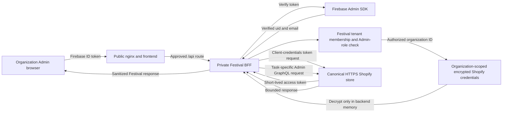

# Festival Security Policy

This document is the authoritative description of Festival's currently enforced trust boundaries. It distinguishes implemented controls from operator-applied deployment settings and deferred work. It does not claim that the development Docker Compose topology is production hardened.

## Current trust model

- The browser receives the SolidJS frontend from nginx and calls only Festival `/api` routes.
- Firebase authenticates Festival administrators and staff. Firebase identity alone does not grant organization access.
- The Festival backend resolves organization membership and role from server-side records. Browser-supplied organization, role, ownership, Shopify identifiers, and credentials are not authority.
- Only an authorized Festival Admin operation may load an organization's encrypted Shopify client secret and call the Shopify Admin API.
- One deployment-wide AES-256-GCM keyring encrypts Shopify client secrets. It is configured with `FESTIVAL_SECRET_KEYS_JSON` and `FESTIVAL_ACTIVE_SECRET_KEY_ID`. Each ciphertext authenticates the organization ID and fixed `shopify-client-secret` purpose as additional authenticated data, so copying an encrypted secret to another organization fails decryption. New writes use the active key; retained previous keys remain available for reads. Re-encryption and safe key retirement are not implemented, so operators must not remove a key while stored ciphertext still references it.
- *Note: When both keyring variables are absent, the backend starts with Shopify services disabled. Partial or invalid keyring configuration causes startup to fail.*



Firebase authenticates the Admin to Festival. It does not authenticate the browser to Shopify. Shopify client secrets and access tokens remain in the private backend boundary and must never be sent to the frontend.

## Current route authentication inventory

| Class | Current routes | Enforcement |
| --- | --- | --- |
| Public | `GET /api/bootstrap`, `GET /api/invites/:token`, and `GET`/`HEAD /api/organizations/:slug/membership-products` | The membership route rejects authorization headers and request bodies, resolves only the Organization's active local Teacher Membership offering, reads current public product facts through Shopify's tokenless Storefront API, returns an allowlisted DTO, and sets `Cache-Control: no-store`. |
| Firebase | `GET /api/firebase-session`, `POST /api/organizations`, `GET /api/memberships`, `POST /api/invites/:token/accept`, `/api/v1/auth/sync`, `/api/v1/auth/login-event`, `/api/v1/auth/me` | A valid Firebase bearer token is required. A Firebase session does not require organization membership. |
| Tenant | `GET /api/organizations/:slug`, `POST /api/organizations/:slug/welcome/dismiss` | Firebase identity plus membership in the route organization is required. |
| Admin | `/api/invites`, organization Admin users, invites, festivals, Shopify settings and diagnostics, and membership-product mutation routes | Firebase identity, matching tenant membership, and Festival `Admin` role are required. Shopify diagnostics accept no request body or browser-selected target and return only allowlisted check results. |
| Customer | Customer auth start/callback, session, membership-purchase resume, profile, orders, and logout routes | Shopify authenticates the customer. Festival stores only an opaque, tenant-bound cookie in the browser. Purchase resume preserves one local offering in consumed OAuth state and revalidates it before token exchange and again for authenticated continuation. Profile mutations require the session CSRF token and exact Festival origin; Firebase bearer tokens are rejected. |
| Customer-profile Admin | `GET /api/organizations/:slug/admin/customers` and `GET /api/organizations/:slug/admin/customers/:customerId` | Firebase identity, matching tenant membership, and Festival `Admin` role are required. Only customers who consented to the current privacy-notice version are searchable or viewable. |
| Private health | Backend `GET /health` | Available only on the private backend listener. Public nginx does not proxy it. |

Backend startup compares every registered route with the declared inventory and fails when a route is missing or declared twice. Adding a route requires updating the inventory, nginx policy when public access is intended, tests, and this document.

## Browser and BFF controls

- Browser origins are exact values from `API_ALLOWED_ORIGINS`, a comma-separated list. Local development defaults allow HTTP ports `5172`, `5173`, and `8080` on `localhost`, IPv4 loopback (`127.0.0.1`), and IPv6 loopback (`[::1]`). Wildcard credentialed CORS is not allowed.
- Current API mutation bodies must be JSON and are limited to 64 KiB. Hono route registration and nginx allow only the methods used today.
- The public membership listing accepts no body, is `GET`/`HEAD` only, emits a single bounded Teacher Membership DTO, caps the tokenless Shopify response at 64 KiB, and uses no-store caching so an unavailable upstream never falls back to a stale price.
- Festival customer profiles contain the latest name, email, structured mailing address, and phone in ordinary tenant-bound database fields so authorized staff search is possible. Application-level field encryption is intentionally not used. Profile responses use explicit allowlists and never expose the internal Festival customer ID to the customer. Logs must not contain profile bodies, search query strings, email addresses, phone numbers, mailing addresses, Shopify customer IDs, session cookies, or CSRF tokens.
- A Shopify customer GID is authoritative only for resolving the organization-scoped Festival customer during the verified OAuth callback. Festival profile edits are locally authoritative per field; later Shopify projections may fill blank or Shopify-sourced fields but cannot overwrite Festival-edited fields. A different Shopify customer GID creates a different Festival customer and is never auto-merged.
- Organization Admin profile view and search require versioned customer consent. Successful searches and views append database audit records containing organization, Firebase actor UID, operation, timestamp, target customer ID for a view, and result count for a search. Search text and profile PII are not recorded in the audit row.
- Festival does not use a shared process-wide request limiter: that design would unfairly combine all callers and conflict with the expected traffic profile. Production rate limiting is deferred to an edge or distributed implementation partitioned by appropriate caller and operation keys.
- Firebase authentication, tenant authorization, and Admin authorization remain application decisions. CORS, nginx, source IP, and any future rate-limit success never grant access.
- `TRUST_PROXY_HEADERS` defaults to false. Set it to `true` only when the backend is reachable exclusively through a trusted nginx that replaces `X-Real-IP` and `X-Forwarded-*`; never enable it on a directly public backend.

## Nginx and health boundary

Both repository configurations enforce the same policy with different upstreams:

- `nginx/festival.conf` is the host-nginx option and proxies to `127.0.0.1:3000`.
- `docker/nginx.festival.conf` is the container-nginx option and proxies to `backend:3000` on the private container network.

Nginx permits only current API path/method combinations, denies unknown `/api`, webhook, internal, metrics, readiness, debug, and backend-health paths, and applies SPA fallback only after those denials. It replaces forwarding headers, bounds request/header timing and size, and logs only remote address, method, path without query string, status, response bytes, and duration. It never logs authorization, cookies, bodies, or query strings.

Public `GET /healthz` is an nginx-owned rollup returning exactly `{"status":"ok"}`. It does not query or expose backend dependency state, versions, tenant data, configuration, readiness detail, or diagnostics.

The jump-host nginx configuration is out of scope because its topology is deployment-specific. An outer proxy must preserve the same default-deny intent and must not make ports `3000` or `5432` public.

## Shopify egress and secret handling

- Public Teacher Membership reads use the canonical verified `*.myshopify.com` domain selected without loading the encrypted Admin credential. The tokenless Storefront request sends no Storefront token, Admin token, Customer Account token, client secret, or authorization header; it disables redirects, bounds time and response size, and accepts only the expected product/variant/price shape.
- Admin-triggered public Storefront diagnostics use the same server-resolved verified domain and credential-free, redirect-disabled, time- and response-bounded transport. The diagnostic recognizes only the exact locked Online Store condition; all other upstream failures are sanitized, and raw responses, request IDs, credentials, tokens, secrets, and tenant-internal identifiers are never returned.
- Current Admin calls construct their own `https://<store>.myshopify.com` token and pinned GraphQL URLs. Festival rejects non-canonical hosts, credentials in URLs, ports, unsafe redirects, timeouts, oversized responses, and malformed JSON.
- No generic GraphQL proxy exists. Each backend operation supplies its own query and variables.
- Client secrets are encrypted at rest, decrypted only in backend memory after tenant/Admin authorization, and excluded from API responses. Access tokens are short-lived, backend-only, and held only in a tenant-bound early-expiry process cache. Saving credentials forces verification and invalidates the superseded integration version.
- Unexpected application errors return stable sanitized messages. Logs must not contain bearer tokens, cookies, Firebase credentials, Shopify client secrets/access tokens, ciphertext, request bodies, sensitive upstream payloads, or customer email data. There is no routine Shopify success/error console logging.
- Each attempted Shopify product mutation appends one bounded NDJSON record to `/var/log/festival/shopify-admin-audit.ndjson`: timestamp, exact verified Firebase actor UID, Festival organization ID, operation, Shopify request ID when returned, result, and bounded failure category. Firebase UIDs follow Firebase's non-empty 128-character contract and are JSON-escaped; organization and request IDs use separate validators; the complete prospective record is validated before mutation and serialized records are capped at 2,048 bytes. The application does not store these records in PostgreSQL or manage rotation/retention, and an unavailable destination fails explicitly.

If credentials may be exposed, stop the affected integration, revoke or rotate the Shopify app credential in Shopify, disable or revoke affected Firebase accounts/sessions where relevant, rotate Festival deployment secrets, and review safe metadata logs. Do not copy suspected secret values into tickets or logs. Re-enable the integration only after verification with replacement credentials.

## Operator-applied UFW settings

Festival does not run `sudo`, invoke UFW, mutate host firewall state, reload nginx, or apply these settings automatically. The following is a reviewable template for a privileged operator with console/recovery access. Replace placeholders before use and preserve an existing management session while validating.

Expected `/etc/default/ufw` setting:

```text
IPV6=yes
```

Baseline command template (run through the operator's approved privilege workflow):

```bash
ufw default deny incoming
ufw default allow outgoing
ufw allow from <TRUSTED_MANAGEMENT_CIDR> to any port 22 proto tcp
ufw allow 80/tcp
ufw allow 443/tcp
ufw deny 3000/tcp
ufw deny 5432/tcp
ufw deny 8080/tcp
ufw enable
```

Apply equivalent IPv4 and IPv6 intent. If nginx itself is intentionally exposed on `8080` instead of being reached through ports 80/443, replace the `8080` deny with the narrowly required allow. Do not expose backend `3000` or PostgreSQL `5432`. Restrict SSH to the actual management CIDR; do not blindly apply the placeholder.

For host nginx, bind the backend to loopback and expose only the selected nginx public ports. For container nginx, publish only the frontend/nginx port and keep backend/PostgreSQL on private Docker networks. Docker-published ports can bypass assumptions about UFW because Docker manages its own packet-filter rules; review Docker's `DOCKER-USER` chain and the platform firewall. The checked-in Compose files publish development ports and are not evidence of a hardened deployment.

Operator verification and recovery commands:

```bash
ufw status verbose
ufw status numbered
ss -lntup
iptables -S DOCKER-USER
ip6tables -S
curl --fail --silent http://127.0.0.1:8080/healthz
```

Confirm from an external test host that only approved public ports answer, and confirm from the host/private network that nginx can reach the backend while the Internet cannot. Keep provider-console access and a tested UFW disable/revert procedure available before changing remote firewall rules.

## Deferred security boundaries

The following remain deferred and must not be inferred from current controls: cart, checkout, order mutation/refund, entitlement workflows, and checkout-time consent capture; customer merge, consent withdrawal, and profile deletion/anonymization workflows; staff customer-search UI; webhook HMAC, replay, deduplication, and queues; event-bus consumers; reconciliation workers; internal job APIs; metrics/readiness/debug APIs; financial-action step-up controls; distributed rate limiting; deployment automation; application-managed audit rotation; and encryption-keyring rotation.

Future implementations require their own route classification, least-privilege nginx exposure, abuse controls, secret/redaction tests, and issue #79 checklist evidence.

## Verification

Repository verification is `bun run format:check`, `bun run build`, and `bun run test`. Nginx policy is tested by deterministic config inspection; this security slice does not run containers, reload nginx, apply UFW, or perform external probes.
