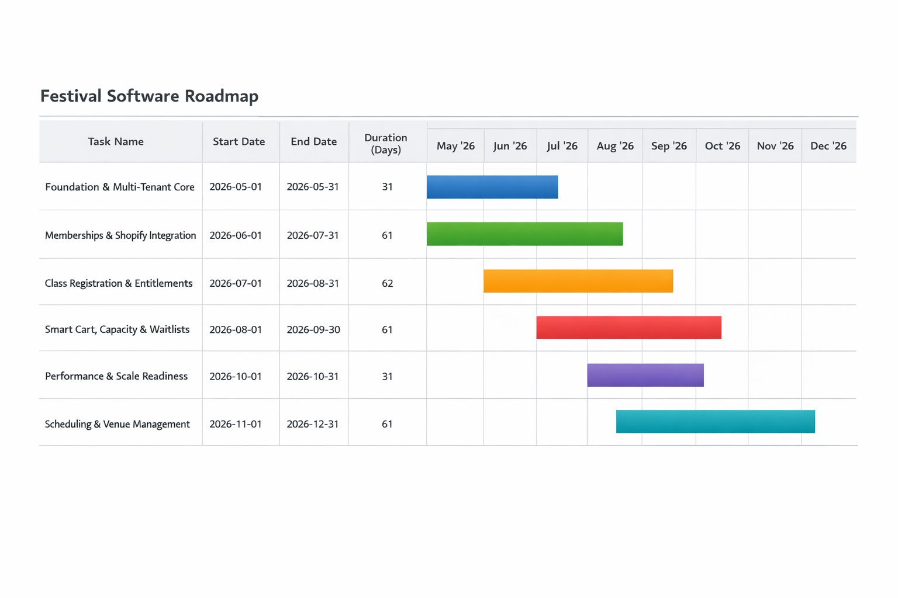

# Festival Software Roadmap (Execution-Oriented)

## Phase 0 — Org + Auth Foundation (Multi-Tenant Spine)

**Goal:** Prove the backend stack and tenant isolation model works end-to-end.

**Scope (strict):**

* Create organization
* Create user (email + Google SSO via Firebase)
* Associate user ↔ organization with role
* Middleware enforces tenant + role
* Persist auth metadata (login_user, authorized_user)

**Deliverables:**

* Hono API with auth middleware
* Postgres schema via Drizzle:

  * `organization`
  * `user`
  * `organization_user`
  * `login_event`
* Firebase JWT verification (no Shopify yet)

**Exit Criteria:**

* User logs in → routed to correct org
* Tenant isolation enforced at DB + API layer
* Role-based access works (Admin vs User)
* All endpoints require valid JWT

**Failure Modes (fix before moving on):**

* Any cross-tenant data leakage
* JWT validation requires external call per request (must cache keys)
* Roles not enforced in middleware

---

## Phase 1 — Memberships via Shopify (Auth Authority Split)

**Goal:** Shopify becomes **system of record for payments + identity (customers)**.

**Scope:**

* Shopify store setup for memberships
* Checkout → webhook → local system
* Map Shopify Customer ↔ local User
* Verify identity using Shopify session/token

**Key Design Decision:**

* Shopify = **identity authority for parents/families**
* Firebase = **internal org/admin auth only**

**Deliverables:**

* Shopify Webhooks:

  * `orders/create`
  * `customers/create`
* Local tables:

  * `membership`
  * `shopify_customer_map`
* Token verification strategy (Shopify session or Multipass or Storefront API)

**Exit Criteria:**

* Purchase membership → user exists locally
* Returning user can authenticate via Shopify
* Membership status reflected locally (active/inactive)

**Failure Modes:**

* Duplicate users (Shopify vs local mismatch)
* No deterministic mapping Shopify customer → local user
* Webhooks not idempotent (this will break you later)

---

## Phase 2 — Class Purchases (Entitlements Model)

**Goal:** Treat Shopify as **entitlement engine**, local app as **metadata + UX layer**.

**Scope:**

* Classes created as Shopify products/variants
* Purchase → entitlement granted
* Local system stores:

  * performer
  * instrument
  * repertoire
  * age group

**Deliverables:**

* Tables:

  * `class_entitlement`
  * `performer`
  * `registration_metadata`
* Webhook ingestion → entitlement creation

**Exit Criteria:**

* Buying a class = entitlement appears locally
* Metadata editable in local app
* Entitlement tied to correct performer + parent

**Failure Modes:**

* Shopify product model too rigid (variants explode)
* Metadata drift between Shopify and local DB
* No clean reconciliation path

---

## Phase 3 — Cart Logic + Waitlists (Critical Complexity Phase)

**Goal:** Own **allocation + fairness logic locally**, not in Shopify.

**Scope:**

* Pre-checkout validation (soft holds)
* Class capacity enforcement
* Waitlist system (ordered, timestamped)
* Global constraints (e.g., max entries per user)

**Key Design Shift:**

* Shopify handles payment
* Local system handles **availability + eligibility**

**Deliverables:**

* Tables:

  * `class_inventory`
  * `waitlist`
  * `cart_hold` (TTL-based)
* APIs:

  * reserve slot (pre-checkout)
  * confirm via webhook
  * release expired holds

**Exit Criteria:**

* No overselling under concurrency
* Deterministic waitlist ordering
* Holds expire cleanly

**Failure Modes (serious):**

* Race conditions → oversubscription
* Shopify checkout succeeds but capacity exceeded locally
* No reconciliation job

---

## Phase 4 — Performance (500 req/sec)

**Goal:** System sustains registration spike load.

**Scope:**

* Load test critical endpoints:

  * auth
  * reserve slot
  * webhook ingestion
* Introduce caching + rate limiting

**Deliverables:**

* Load test scripts (k6 or similar)
* Caching:

  * JWT verification keys
  * class inventory reads
* DB tuning:

  * indexes on hot paths
  * connection pooling

**Exit Criteria:**

* Sustained 500 req/sec on:

  * read-heavy endpoints
  * 100–200 req/sec on write paths
* P95 latency < 250ms

**Failure Modes:**

* DB contention on inventory rows
* Locking strategy too coarse
* Webhook backlog under load

---

## Phase 5 — Scheduling + Physical Space Modeling

**Goal:** Translate registrations → real-world schedule.

**Scope:**

* Model:

  * rooms
  * time slots
  * adjudicators
* Assign performers to slots
* Handle constraints:

  * instrument
  * age group
  * availability

**Deliverables:**

* Tables:

  * `room`
  * `time_slot`
  * `schedule_assignment`
* Basic scheduling UI (manual first, not automated)

**Exit Criteria:**

* Admin can:

  * define rooms + slots
  * assign performers
* Export schedule (PDF/CSV)

**Failure Modes:**

* Over-automation too early (don’t build a solver yet)
* No audit trail for changes
* No ability to override assignments quickly

---

# Critical Cross-Phase Decisions (Non-Negotiable)

### 1. Identity Split (Lock This Early)

* Shopify → parents/families
* Firebase → admins/org users
  If this drifts, you’ll rebuild auth twice.

---

### 2. Webhooks = Source of Truth

Everything async:

* Must be **idempotent**
* Must be **replayable**
* Must be **logged**

---

### 3. Inventory Ownership

* Shopify **does NOT** control class capacity
* Your DB **must be authoritative**

---

### 4. No “Magic Sync”

* Always assume:

  * Shopify and local DB **will diverge**
* Build reconciliation jobs early (Phase 2–3)

