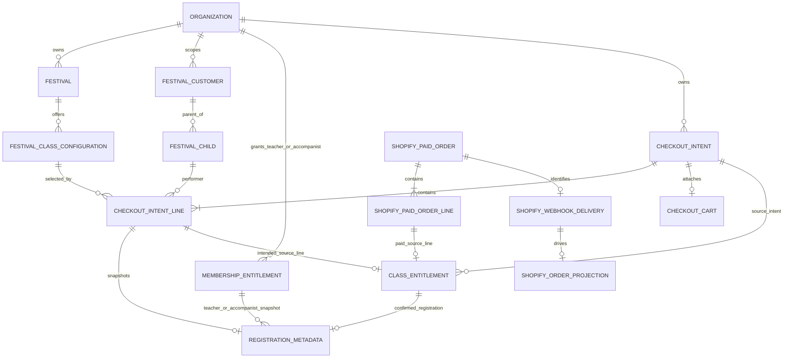
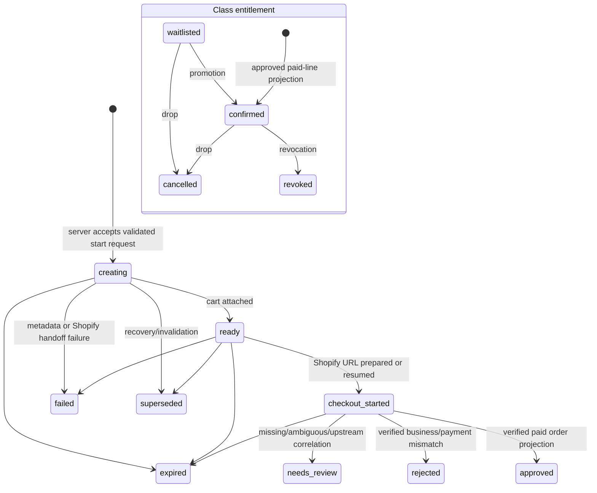
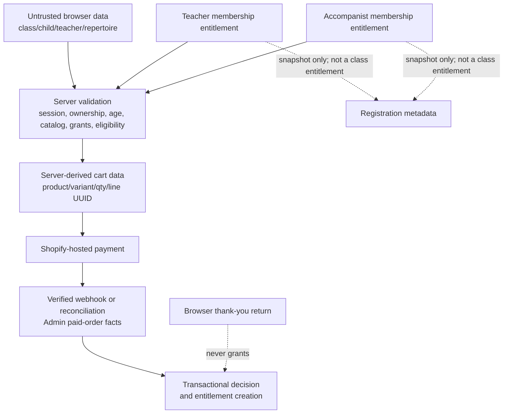

# Issue #258: Current Multi-line Class Checkout Graph

## Scope and baseline

This is a code-derived graph of the checkout that exists at review time, not a
proposal for the Issue #258 change. The checkout is on detached `HEAD` at the
same commit as `origin/main` (`dea2aad4bc3717ec688ef68bb2bc19dfcbb9d00b`). The
working tree was clean when that review baseline was captured, before the two
documentation artifacts were created. Source references use the current checkout.

The historical Phase 2 document describes a one-class checkout, but the
current browser, API, intent, and projection paths support multiple class
lines. Therefore `specs/Phase-2-Class-Purchase-Entitlement.md` is historical
context only; current code is authoritative.

## 1. Request and control flow

```mermaid
flowchart LR
  subgraph Browser[Browser — client-controlled]
    Select[FestivalClassRegistrationPage\nchild → division → teacher → class\nrepertoire / accompanist]
    Cart[registrationCartState\nin-memory cart]
    Gate[useCartEligibility\nadvisory display gate]
    Api[frontend lib/api]
    Redirect[window.location.assign\nvalidated checkout URL]
    Account[Customer Order History\nconfirmed registrations]
  end

  subgraph Festival[Festival server — authoritative]
    Routes[customer registration routes\nsession + CSRF + field allowlist]
    Eligibility[ClassCheckoutService\nvalidate lines + re-run eligibility]
    Intent[CheckoutRepository\nintent + intent lines + metadata + cart]
    Storefront[ShopifyMembershipCheckoutClient\ncartCreate + checkout URL]
    Webhook[orders/paid webhook\nverified delivery]
    Reconcile[reconciliation\npaid-order scan]
    Project[ShopifyOrderProjectionService\nread, validate, finalize]
    Commerce[MembershipCommerceRepository\none transaction]
    Lifecycle[Account / billing / recovery\ndrop, transfer, promotion]
  end

  subgraph Shopify[Shopify — payment authority]
    CartApi[Storefront cart]\n
    Paid[Paid order]
    Admin[Admin paid-order read]
    ThankYou[Thank-you / order-status extension]
  end

  Select --> Cart --> Gate --> Api --> Routes --> Eligibility --> Intent
  Intent --> Storefront --> CartApi --> Redirect
  CartApi --> Paid
  Paid --> Webhook --> Project
  Paid --> Reconcile --> Project
  Project --> Admin
  Project --> Commerce --> Intent
  Commerce --> Lifecycle --> Account
  Paid --> ThankYou --> Account
```

| Edge / node | Verified source | Current behavior |
| --- | --- | --- |
| Selection → cart | `packages/frontend/src/pages/FestivalClassRegistrationPage.tsx:149-170`; `packages/frontend/src/pages/registrationCartState.ts:91-185` | The cart is browser memory. It prevents duplicate child/class selections for UX, but it is not an authorization boundary. |
| Cart → advisory eligibility | `packages/frontend/src/pages/useCartEligibility.ts:79-128`; `packages/frontend/src/lib/api.ts:1372-1422`; `packages/backend/src/routes/customer/customer-registration.routes.ts:198-253` | The route evaluates the proposed items, but the result merely enables/disables the checkout button. |
| API → checkout start | `FestivalClassRegistrationPage.tsx:172-212`; `packages/frontend/src/lib/api.ts:1445-1515`; `customer-registration.routes.ts:142-195` | The browser sends `lineItems`, CSRF, and a UUID idempotency key. The server resolves organization/customer/buyer token from its cookie session and returns only the Shopify URL and correlation ID. |
| Start → validated intent | `packages/backend/src/checkout/class-checkout-service.ts:132-216,219-424,426-463` | The server validates child ownership, fresh age snapshot, target festival/class, repertoire, teacher and accompanist membership grants, then repeats purchase eligibility before creating a 30-minute multi-line intent. |
| Intent → metadata / cart | `class-checkout-service.ts:493-623`; `packages/backend/src/checkout/postgres-checkout-repository.ts:69-153,330-370` | One durable intent holds `N` durable intent lines. One metadata record is written per line before a Shopify cart is created. |
| Intent line → Shopify cart line | `class-checkout-service.ts:516-552`; `packages/backend/src/checkout/shopify-membership-checkout-client.ts:29-81` | Each cart line has quantity 1 and `festival_checkout_intent_line_id=<intent-line UUID>`. The cart as a whole has `festival_checkout_intent_id=<correlation UUID>`. |
| Shopify cart → browser redirect | `class-checkout-service.ts:567-594`; `FestivalClassRegistrationPage.tsx:190-193` | Festival validates the HTTPS URL against the current configured shop domain, then the browser navigates. No redirect response grants an entitlement. |
| Paid order → projection | `packages/backend/src/commerce/shopify-webhook-service.ts:104-195`; `packages/backend/src/commerce/shopify-order-projection-service.ts:193-285,406-458` | A verified `orders/paid` delivery is claimed and projected; reconciliation can read paid orders independently. Both paths call the same paid-order reader/projection service. |
| Projection → entitlements | `shopify-order-projection-service.ts:604-746`; `packages/backend/src/commerce/postgres-membership-commerce-repository.ts:656-797` | The finalization transaction writes the order projection/decision, class entitlement(s), registration metadata link(s), intent status, and delivery completion. |
| Paid order → return account | `packages/shopify-confirmation/extensions/festival-account-return/src/return-button.ts`; `packages/shopify-confirmation/README.md:3-7`; `packages/frontend/src/pages/CustomerAccountOrdersPage.tsx:252-433` | The extension links only to the Festival account’s `?checkout=processing` route. Account history reads server-confirmed registrations; it does not treat the return as payment proof. |

### Current Issue #258 break in this flow

The write edge supplies a line UUID, but the Admin paid-order contract does not
read a paid line's custom attributes (`packages/backend/src/shopify/types.ts:135-147`; `packages/backend/src/shopify/admin-api-client.ts:395-426,1169-1200,1316-1348`). Consequently, multi-line validation and finalization pair
`intent.lines[i]` with `order.lineItems[i]` by position
(`packages/backend/src/commerce/shopify-order-projection-service.ts:658-692,850-879`). The order of paid lines is not a verified identity boundary, so this
edge is unsafe for reordered lines or repeated product/variant purchases.

The source code proves that Festival writes the cart-line attribute. It does
not prove that each deployed target store exposes that attribute on the Admin
paid-order line; that runtime edge must be verified during Issue #258 rollout.

## 2. Persistence and identity graph



The intended identity chain is:

```text
1 checkout intent → N checkout-intent lines → N Shopify cart/order lines → N class entitlements
```

| Relationship / invariant | Current enforcement and evidence |
| --- | --- |
| Tenant and customer scope | The intent records `organization_id`, `customer_id`, and `session_id`; the server receives those only from `checkoutAccess` (`customer-registration.routes.ts:142-195`; `postgres-schema.ts:238-276`). Class and child FKs hold local identities. |
| Intent idempotency | Unique `(organization_id, customer_id, session_id, idempotency_key)` and a customer-scoped PostgreSQL advisory lock (`packages/backend/src/repo/postgres-schema.ts:710-729`; `postgres-checkout-repository.ts:47-129`). |
| Intent → line cardinality | `checkout_intent_lines.checkout_intent_id` is non-null with cascade delete, but no database unique key currently protects `line_index` (`postgres-schema.ts:249-268,740-742`). The helper creates one generated line for legacy/single-line callers and one generated UUID per supplied line (`checkout-line-helpers.ts:9-55`). |
| Line → metadata | `registration_metadata.checkout_intent_line_id` is FK-backed and has a partial unique index, so at most one metadata record can claim a non-null line ID (`postgres-schema.ts:350-357,743-750`). |
| Order-line → entitlement | `class_entitlements` records both order and order-line GIDs, and `(organization_id, shopify_order_line_gid)` is unique (`postgres-schema.ts:277-298,725-731`). `checkout_intent_line_id` is nullable and **not unique**, leaving the other side of a one-to-one line mapping unenforced. |
| Teacher/accompanist dependency | `ClassCheckoutService.validateTeacherAndAccompanist` requires an active teacher membership in the selected division and optional current accompanist grant (`class-checkout-service.ts:253-337`). Their IDs are snapshots in registration metadata, not `ClassEntitlement` records. |
| Paid allocation | `ClassEntitlement.paidAmountCents` and `paidCurrencyCode` are immutable projection facts in the domain contract (`packages/common/src/entitlements.ts:310-379`). They should be the basis for any later refund. |

## 3. Lifecycle and trust boundaries





| Boundary / later consumer | Current behavior |
| --- | --- |
| Webhook replay, concurrency, reconciliation | Delivery claiming and `finalizeDecision` make one decision/projection transaction; a repeated order line conflicts on the unique order-line index. See `shopify-order-projection-service.ts:193-335` and `postgres-membership-commerce-repository.ts:656-797`. This does not repair a wrong first positional assignment. |
| Customer account | Authenticated `CustomerAccountService.listClassRegistrations` reads entitlement plus linked metadata for the account UI (`packages/backend/src/customer/customer-account-service.ts:1121-1207`). |
| Billing and recovery | Billing reads entitlement/order facts; recovery refuses source intents once an order projection or entitlement exists (`packages/backend/src/checkout/postgres-checkout-recovery-repository.ts:134-147`; `packages/backend/src/billing/postgres-billing-repository.ts:308-386`). |
| Drop, transfer, and promotion | They act on a single entitlement ID and use its stored order GID, order-line GID, paid amount, and currency (`packages/backend/src/registration/drop-transfer-service.ts:303-385,430-654`). The present refund provider discards the known order-line GID and does not send `amountCents` in its live mutation (`packages/backend/src/shopify/shopify-admin-client.ts:151-204`), a separate Issue #258 remediation requirement. |

## Evidence limits

- No local database was queried or mutated. The source schema and migrations are
  the evidence for persistence constraints.
- Cart-line attribute survival from Storefront cart to paid Admin order line is
  not assumed; it is an operational rollout check.
- Capacity/waitlist policy is already represented in eligibility/lifecycle
  code but Issue #258 changes neither capacity allocation timing nor the
  class-registration selection contract.
