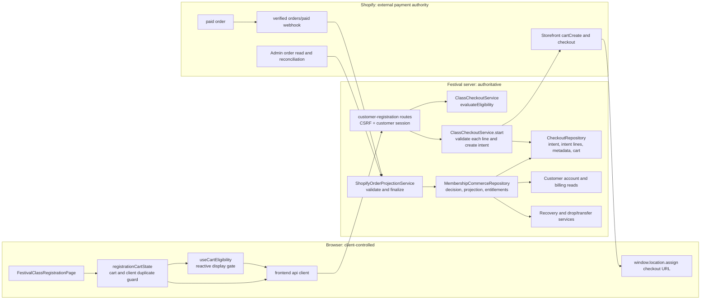
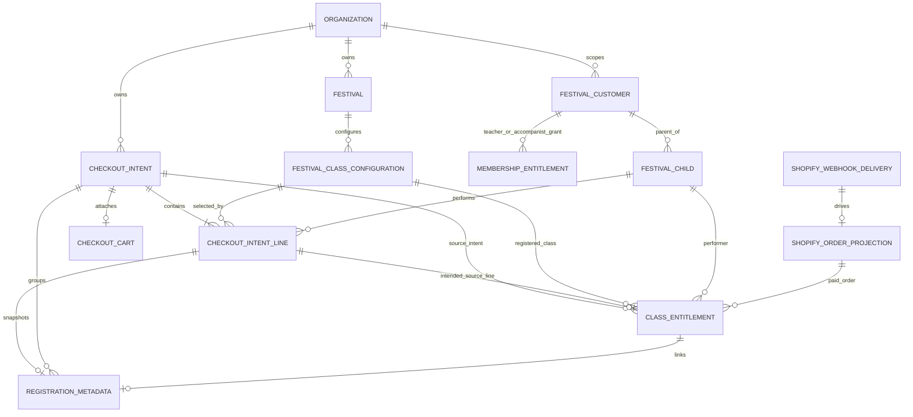
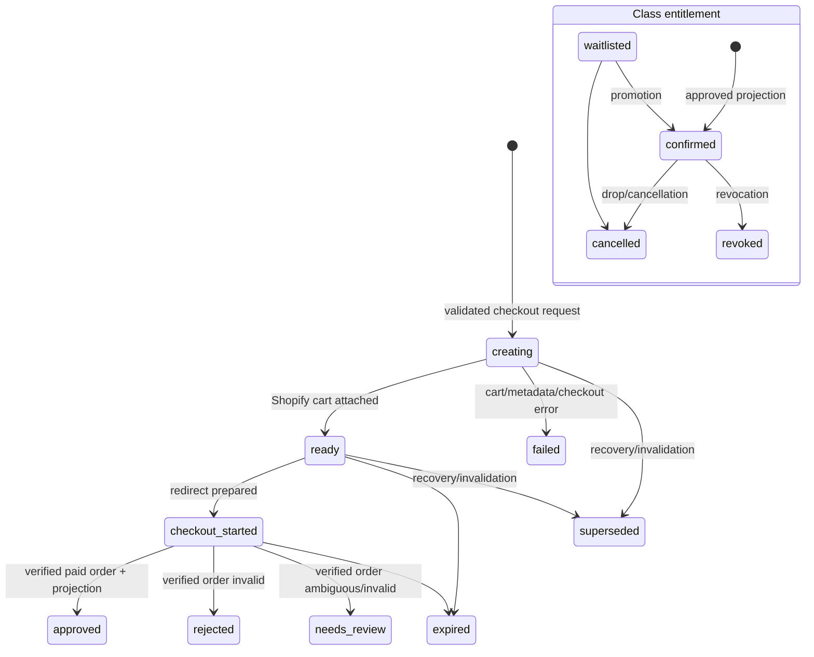

# Multi-line Class Purchase and Entitlement Graph

## Scope and evidence

This graph is grounded in the current working tree, with `origin/main` merge-base
`dc173518b1fc5ba1f403b43343379136cffd9fcb`. It documents code paths, not the
historical Phase 2 plan. References name the source file and symbol that verifies
each edge. An edge is marked **unverified** when the code does not retain enough
data to prove it.

## 1. Request and control flow



### Node and edge index

| Edge / node | Verified source and symbol | Notes |
| --- | --- | --- |
| `Page → Cart → API` | `packages/frontend/src/pages/FestivalClassRegistrationPage.tsx`: `handleAddToCart`, `handleCartCheckout`, `executeCheckout`; `packages/frontend/src/pages/registrationCartState.ts`: `createRegistrationCart`, `cartItemsToLineItemInputs`; `packages/frontend/src/lib/api.ts`: `startClassCheckout` | The browser cart is only a UX aid. Its price and eligibility values are not trusted by the server. |
| `Reactive → API` | `packages/frontend/src/pages/useCartEligibility.ts`: `useCartEligibility`; `packages/frontend/src/lib/api.ts`: `evaluateRegistrationEligibility` | Reactive eligibility is a display gate; `start` revalidates before creating the cart. |
| `API → Routes → Checkout` | `packages/backend/src/routes/customer/customer-registration.routes.ts`: `handleClassCheckout`, `handleEvaluateEligibility`, `buildCheckoutInput`; `packages/backend/src/checkout/class-checkout-service.ts`: `start`, `evaluateEligibility` | Route derives organization/customer/session/token from the customer account session and enforces CSRF. |
| `Checkout → Repo` | `packages/backend/src/checkout/class-checkout-service.ts`: `createMultiLineIntent`, `insertAllRegistrationMetadata`, `createAndVerifyCart`; `packages/backend/src/checkout/postgres-checkout-repository.ts`: `createIntent`, `attachCart` | One intent is created before the external cart. Metadata is written per intent line. |
| `Checkout → Shopify` | `packages/backend/src/checkout/class-checkout-service.ts`: `createAndVerifyCart`; `packages/backend/src/checkout/shopify-membership-checkout-client.ts`: `createCart`, `checkout` | Server emits one Shopify cart line per intent line with `festival_checkout_intent_line_id`. |
| Browser redirect boundary | `FestivalClassRegistrationPage.tsx`: `executeCheckout` | The browser only follows a validated HTTPS checkout URL. It does not create an entitlement. |
| `orders/paid → Project` | `packages/backend/src/commerce/shopify-webhook-service.ts`: `handle`; `packages/backend/src/commerce/shopify-order-projection-service.ts`: `processDelivery` | Webhook ingress records a delivery then schedules projection. The internal reconciliation route invokes `reconcile`, which also calls `processDelivery`. |
| `Project → Commerce → Repo` | `shopify-order-projection-service.ts`: `validateClassPurchase`, `finalizeMultiLineClassPurchase`, `finalize`; `packages/backend/src/commerce/postgres-membership-commerce-repository.ts`: `finalizeDecision` | Paid-order validation, decision, order projection, class-entitlement creation, metadata linking, intent resolution, and delivery completion are one Postgres transaction. |
| `Commerce → account/billing/lifecycle` | `packages/backend/src/customer/customer-account-service.ts`: `listClassRegistrations`; `packages/backend/src/billing/*`; `packages/backend/src/registration/drop-transfer-service.ts`; `packages/backend/src/checkout/checkout-recovery-service.ts` | Customer-facing registration, billing reconciliation, recovery, cancellation, drop, transfer, waitlist, and promotion consume entitlement records. |

**Important unverified edge:** the per-cart-line `festival_checkout_intent_line_id`
attribute is emitted by `ClassCheckoutService`, but `ShopifyPaidOrderLine` and the
Admin order query do not retain it (`packages/backend/src/shopify/types.ts`:
`ShopifyPaidOrderLine`; `packages/backend/src/shopify/admin-api-client.ts`:
`readOrderByGid`). Therefore the intended `Shopify cart line → Shopify paid order
line → checkout intent line` identity edge is not verified by current code.

## 2. Persistence and identity graph



### Identity, cardinality, and constraints

| Relationship | Current database/code constraint |
| --- | --- |
| Organization → festival/class/customer | Organization foreign keys scope the canonical festival, class configuration, parent customer, and child tables (`packages/backend/src/repo/postgres-schema.ts`: `buildCanonicalPostgresSchemaSql`). |
| Checkout intent idempotency | Unique `(organization_id, customer_id, session_id, idempotency_key)` (`postgres-schema.ts`: `checkout_intents_scope_key`), plus a customer-scoped advisory lock in `PostgresCheckoutRepository.createIntent`. |
| Intent → intent lines | `checkout_intent_lines.checkout_intent_id` is a non-null FK with cascade delete. Intent line stores the server-derived class, child, product/variant, amount, currency, and division snapshot. |
| Intent → cart | Cart is attached after Shopify cart creation through `checkout_intents.cart_reference`; cart carries organization/customer/session/integration scope. |
| Intent line → registration metadata | Metadata has the per-line FK and a unique partial index on `checkout_intent_line_id`, so at most one metadata record can claim a non-null line ID. |
| Intent line → class entitlement | `class_entitlements.checkout_intent_line_id` is nullable FK. There is **no unique constraint** on it; the only direct duplicate barrier is unique `(organization_id, shopify_order_line_gid)`. Code currently creates one entitlement for each projected line. |
| Shopify order / line identity | There is no normalized Shopify order-line table. `shopify_order_projections` stores order-level data; `ClassEntitlement` stores `shopify_order_gid` and `shopify_order_line_gid`; webhook delivery records the verified event. |
| Teacher/accompanist dependency | A teacher grant snapshot is required per line and an accompanist grant snapshot is optional (`ClassCheckoutService.validateTeacherAndAccompanist`). These membership grants gate registration, then their IDs are snapshot in metadata; they are not `ClassEntitlement` records. |

The intended cardinality is:

```text
1 checkout intent → N checkout-intent lines → N Shopify cart/order lines → N class entitlements
```

The first two relationships are persisted. The final two are not completely
enforced: the database enforces the Shopify order-line side, while the current
projection only pairs order and intent lines by list position. See the review
findings for the resulting correctness impact.

## 3. Lifecycle and trust boundaries



| Boundary or lifecycle edge | Verified implementation |
| --- | --- |
| Client input → server authority | `ClassCheckoutService.validateSessionAndCustomer`, `validateLine`, and `checkEligibility` resolve the customer, child ownership, age snapshot, active class/festival, membership grants, repertoire, duplicate, prerequisite, and capacity checks server-side. |
| Server → Shopify | `createAndVerifyCart` derives variant, amount, and cart-line attributes from validated class configuration/intent lines, then validates the returned checkout URL against the verified integration domain. |
| Shopify → server authority | `ShopifyWebhookService.handle` verifies `orders/paid` before accepting delivery. `ShopifyOrderProjectionService` reads the order from the Admin client, validates it, then finalizes the decision. Internal reconciliation is independently token-protected in `app.ts`. |
| Projection retry and idempotency | Deliveries are de-duplicated by webhook identity and finalization is serialized around the order/intent/customer in `PostgresMembershipCommerceRepository.finalizeDecision`. A transaction rolls back partial entitlement/metadata/decision/projection writes. |
| Recovery | `CheckoutRecoveryService` blocks recovery/invalidation once an order projection or entitlement exists. Its resume path is currently membership-shaped and does not reconstruct a class intent's line records; this is a verified gap listed below. |
| Drop/transfer/promotion | `DropTransferService` acts on an entitlement ID with organization/parent/festival checks and transitions `confirmed`, `waitlisted`, `cancelled`, and `revoked` states. |

## Explicit unknowns

- Shopify’s external persistence/return of arbitrary cart-line attributes is not
  proven by this repository and is not queried by the Admin client. The graph
  does not assume it supplies a stable correlation key.
- Whether class capacity should reserve a seat at checkout initiation, or decide
  confirmed versus waitlisted at payment projection, is policy not encoded in
  the checkout path. The current path validates a snapshot before external
  checkout and projects every accepted line as `confirmed`.
